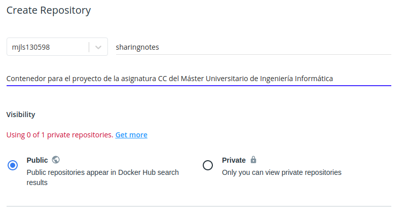
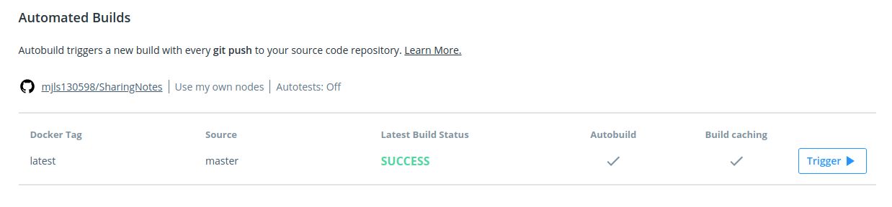

# SharingNotes

## Descripción del problema

En estos momentos, al ser la gran mayoría de las clases virtuales, es difícil recoger buenos apuntes de las asignaturas ya sea por problemas tecnológicos o al no estar físicamente con tus compañeros para compartir conocimientos.

Por lo tanto, este proyecto se basa en crear una plataforma donde cualquier alumno pueda subir sus apuntes para que los vean el resto, visualizar aquellos que necesite, buscar aquel apunte que necesita acceder, compartirlo por alguna red social o realizar comentarios sobre un apunte en concreto.

## Herramientas y tecnologías escogidas

* La arquitectura de este proyecto está basada en una arquitectura microservicios.
* El siguiente programa está escrito en el lenguaje de programación *Scala*.
* El gestor de tareas y el marco de prueba que se va a utilizar es *sbt (Scala Build Tool)*.
* La biblioteca que se va a usar para realizar los test es la bibliteca *ScalaTest*.

## Poner en marcha el proyecto

1. Descargar este proyecto en el dispositivo:
  `git clone git@github.com:mjls130598/SharingNotes.git`

2. Dirigirse a la carpeta del proyecto:
  `cd SharingNotes/src/SharingNotes`

4. Compilar el programa:
  `sbt compile`

5. Ejecutar el programa:
  `sbt run`

6. Ejecutar los test del proyecto:
  `sbt test`

Si fuera necesario realizar una limpieza del proyecto:
  `sbt clean`

## Actividades relacionadas con Milestone 2

### Estructura del proyecto

Las clases que la forman son:

* [**Apunte**](https://github.com/mjls130598/SharingNotes/blob/master/src/SharingNotes/src/main/scala/Apunte.scala): almacena la información necesaria para el manejo de un apunte.
* [**Asignatura**](https://github.com/mjls130598/SharingNotes/blob/master/src/SharingNotes/src/main/scala/Asignatura.scala): almacena los datos necesarios para manejar una asignatura dentro del sistema.
* [**Comentario**](https://github.com/mjls130598/SharingNotes/blob/master/src/SharingNotes/src/main/scala/Comentario.scala): guarda aquella información necesaria para crear un comentario.
* [**Usuario**](https://github.com/mjls130598/SharingNotes/blob/master/src/SharingNotes/src/main/scala/Usuario.scala): conserva la información de un usuario del sistema.
* [**Administrador**](https://github.com/mjls130598/SharingNotes/blob/master/src/SharingNotes/src/main/scala/Administrador.scala): guarda la información del usuario *Administrador*
* [**SharingNotes**](https://github.com/mjls130598/SharingNotes/blob/master/src/SharingNotes/src/main/scala/SharingNotes.scala): almacena toda la información necesaria para el manejo del sistema.
* **Búsqueda**: se encarga de las consultas y de los filtrados que desean hacer los usuarios. Se realizará su implementación en los siguientes milestones.

### Funciones realizadas

Las funciones que se han realizados, además de sus correspondientes tests, son las siguientes:

* [**Añadir usuario**](https://github.com/mjls130598/SharingNotes/blob/d1cc1af8772e0b11eca7411ec43af78ada6ae07f/src/SharingNotes/src/main/scala/SharingNotes.scala#L20): se encarga de insertar un nuevo usuario en la memoria del sistema.
  * En los test correspondientes a este método se encuentran en [este enlace](https://github.com/mjls130598/SharingNotes/blob/17aebbd100823f08c25118b91090e8700ccf0386/src/SharingNotes/src/test/scala/SharingNotesTest.scala#L11).
  * Este método corresponde a la historia de usuario [HU1](https://github.com/mjls130598/SharingNotes/issues/10).

* [**Añadir asignatura**](https://github.com/mjls130598/SharingNotes/blob/d1cc1af8772e0b11eca7411ec43af78ada6ae07f/src/SharingNotes/src/main/scala/SharingNotes.scala#L24): se encarga de que el administrador del sistema añada una asignatura al programa.
  * Los test que comprueban el correcto funcionamiento del método se encuentra [aquí](https://github.com/mjls130598/SharingNotes/blob/17aebbd100823f08c25118b91090e8700ccf0386/src/SharingNotes/src/test/scala/SharingNotesTest.scala#L23).
  * Este método está indicado en la historia de usuario [HU8](https://github.com/mjls130598/SharingNotes/issues/18).

* [**Borrar asignatura**](https://github.com/mjls130598/SharingNotes/blob/d1cc1af8772e0b11eca7411ec43af78ada6ae07f/src/SharingNotes/src/main/scala/SharingNotes.scala#L42): el administrador del sistema borra una de las asignaturas que están guardadas en el sistema.
  * En esta [línea de código](https://github.com/mjls130598/SharingNotes/blob/17aebbd100823f08c25118b91090e8700ccf0386/src/SharingNotes/src/test/scala/SharingNotesTest.scala#L151) se encuentran los test de esta función.
  * En la historia de usuario [HU9](https://github.com/mjls130598/SharingNotes/issues/19) se explica la función que debe realizar este método.

* [**Añadir apunte**](https://github.com/mjls130598/SharingNotes/blob/d1cc1af8772e0b11eca7411ec43af78ada6ae07f/src/SharingNotes/src/main/scala/SharingNotes.scala#L59): insertar en la memoria de la aplicación un apunte dado.
  * Su test correspondiente se encuentra en [este link](https://github.com/mjls130598/SharingNotes/blob/17aebbd100823f08c25118b91090e8700ccf0386/src/SharingNotes/src/test/scala/SharingNotesTest.scala#L45).
  * Su funcionalidad ha sido sacada de la historia de usuario [HU2](https://github.com/mjls130598/SharingNotes/issues/12).

* [**Borrar apunte**](https://github.com/mjls130598/SharingNotes/blob/d1cc1af8772e0b11eca7411ec43af78ada6ae07f/src/SharingNotes/src/main/scala/SharingNotes.scala#L77): el administrador del sistema indica el apunte que desea eliminar definitivamente del programa.
  * Los test pertenecientes a esta función se pueden encontrar [aquí](https://github.com/mjls130598/SharingNotes/blob/17aebbd100823f08c25118b91090e8700ccf0386/src/SharingNotes/src/test/scala/SharingNotesTest.scala#L107).
  * Este método corresponde a la historia de usuario [HU6](https://github.com/mjls130598/SharingNotes/issues/16).

* [**Buscar los apuntes de una asignatura**](https://github.com/mjls130598/SharingNotes/blob/d1cc1af8772e0b11eca7411ec43af78ada6ae07f/src/SharingNotes/src/main/scala/SharingNotes.scala#L97): dada una asignatura, devuelve todos los apuntes que pertenezcan a esa asignatura.
  * El test de este método se puede ver a través del [siguiente enlace](https://github.com/mjls130598/SharingNotes/blob/17aebbd100823f08c25118b91090e8700ccf0386/src/SharingNotes/src/test/scala/SharingNotesTest.scala#L143).
  * Este método cumple parte de la historia de usuario [HU10](https://github.com/mjls130598/SharingNotes/issues/24).

* [**Añadir comentario**](https://github.com/mjls130598/SharingNotes/blob/d1cc1af8772e0b11eca7411ec43af78ada6ae07f/src/SharingNotes/src/main/scala/SharingNotes.scala#L109): se encarga de añadir un comentario sobre un apunte en concreto al programa.
  * Su test correspondiente está en el [siguiente enlace](https://github.com/mjls130598/SharingNotes/blob/17aebbd100823f08c25118b91090e8700ccf0386/src/SharingNotes/src/test/scala/SharingNotesTest.scala#L63).
  * Su funcionalidad se encuentra explicada en la historia de usuario [HU3](https://github.com/mjls130598/SharingNotes/issues/13).

* [**Borrar comentario**](https://github.com/mjls130598/SharingNotes/blob/d1cc1af8772e0b11eca7411ec43af78ada6ae07f/src/SharingNotes/src/main/scala/SharingNotes.scala#L120): el administrador del sistema se encarga de borrar aquellos comentarios que no desea que sigan visibles en el sistema.
  * Sus test correspondientes se encuentran [aquí](https://github.com/mjls130598/SharingNotes/blob/17aebbd100823f08c25118b91090e8700ccf0386/src/SharingNotes/src/test/scala/SharingNotesTest.scala#L74).
  * Este método se ha sacado de la historia de usuario [HU7](https://github.com/mjls130598/SharingNotes/issues/17).

* [**Buscar comentarios de un apunte**](https://github.com/mjls130598/SharingNotes/blob/d1cc1af8772e0b11eca7411ec43af78ada6ae07f/src/SharingNotes/src/main/scala/SharingNotes.scala#L129): mostrar aquellos comentarios sobre un apunte previamente dado.
  * El test de esta función se puede observar [aquí](https://github.com/mjls130598/SharingNotes/blob/17aebbd100823f08c25118b91090e8700ccf0386/src/SharingNotes/src/test/scala/SharingNotesTest.scala#L99).
  * Este método corresponde a la historia de usuario [HU12](https://github.com/mjls130598/SharingNotes/issues/31).

### Justificación del gestor de tareas y del marco de prueba elegidos

Para *Scala* se ofrece una diversidad de gestores de tareas como los siguientes:

* **sbt (Scala Build Tool)**:
  * Ofrece una estructura de directorios sencilla que separa los test del código en sí:
    ```
    build.sbt
    project/
    src/
      |-- main/
        |-- java/
        |-- resources/
        |-- scala/
      |-- test/
        |-- java/
        |-- resources/
        |-- scala/
    target
    ```
  * Fue específicamente creada para *Scala*.
  * Soporte nativo para integrarse con muchos marcos de prueba.
  * Ofrece la compilación, los test y la implementación.
  * Sólo se vuelve a compilar aquellas fuentes que se hayan modificado o las pruebas que no se hayan superado previamente.
  * Construye las descripciones escritas en *Scala* usando *DSL*.
  * La gestión de dependencias la realiza a través de *Apache Ivy*, la cual permite los repositorios en formato Maven.
  * Rápida iteración y depuración al incorporar el intérprete de *Scala*.
  * Soporta proyectos mixtos Java-Scala.

* **Maven**:
  * Su estructura de directorios es similar a la de *sbt*.
  * Con un archivo en XML describe el proyecto de software que se está construyendo, sus dependencias, el orden de construcción, los directorios y los complementos necesarios.
  * Utiliza convenciones para el procedimiento de compilación y solo es necesario anotar las excepciones.
  * Descarga dinámicamente las bibliotecas de Java y los complementos de Maven y los almacena en una caché local.
  * Las dependencias se pueden cargar desde el sistema de archivos local o desde repositorios públicos.
  * Tiene una arquitectura basada en complementos que le permite hacer uso de cualquier aplicación controlable a través de la entrada estándar.
  * Como *sbt*, incorpora la compilación, los tests y la implementación.
  * Intenta evitar la mayor cantidad de configuración posible, proporcionando plantillas de proyecto.
  * Ofrece aislamiento entre las dependencias del proyecto y los complementos.

* **Gradle**:
  * Utiliza un DAG para determinar el orden en el que las tareas pueden ser ejecutadas.
  * Introduce *Groovy* y *Kotlin* basados en *DSL*.
  * Diseñado para la compilación de proyectos grandes.
  * Admite el almacenamiento en caché de componentes de compilación.
  * Ofrece un software que es extensible para nuevas funciones y lenguajes de programación con un subsistema de complementos.
  * Como los dos gestores anteriores, ofrece la compilación, los test y la implementación del proyecto.
  * Como *sbt* y *Maven*, separa los ficheros de distintos idiomas en distintas carpetas, divide el código que implementa el proyecto y el que realiza los tests e incluye un fichero de configuración y varias carpetas con un archivo de construcción por cada subproyecto.

Se elige *sbt* al ser el más utilizado para realizar proyectos en *Scala*, al tener una estructura de escritorio sencilla, al ser fácil su uso y al no estar archivo de configuración en XML. Su configuración se encuentra en el fichero [*build.sbt*](https://github.com/mjls130598/SharingNotes/blob/master/src/SharingNotes/build.sbt).

### Justificación de la biblioteca de aserciones

En Scala hay varias bibliotecas que se encargan de realizar las aserciones. En este caso se centrarán en las siguientes:

* **ScalaTest**:
  * Soporta diferentes estilos de test.
  * Es la herramienta de test más flexible actualmente.
  * Se puede utilizar tanto para *Scala* como para *Java*.
  * Puede escalar en proyectos de todos los tamaños.
  * Es muy rápido aprender a realizar tests.
  * Se pueden realizar tanto tests *TDD* como *BDD*.
  * Se pueden hacer múltiples comparaciones en una prueba.
  * Los *DSLs* para *Scala* son más potentes que los de *Java*.
  * Ofrece, además de aserciones, potentes *matchers*.

* **JUnit**:
  * Es un marco de código abierto que se ocupa de la escritura y de la ejecución de los tests de un proyecto.
  * Está pensado para utilizarlo en *Java*.
  * Es rápido y sencillo escribir el código.
  * Muestra el progreso de la prueba en una barra.
  * Se puede realizar tanto *BDD* como *TDD*.

* **ScalaCheck**:
  * Se puede utilizar tanto en *Java* como en *Scala*.
  * Está integrado sobre otros marcos de prueba como *ScalaTest*.
  * No utiliza aserciones, sino propiedades.
  * Dentro de una propiedad, se pueden añadir varios argumentos que comprueben el correcto funcionamiento de una parte del código del proyecto.
  * Ofrece un generador de datos para utilizarlos en los tests.
  * Para comprobar que una función se realiza correctamente, ejecuta más de una vez el test que comprueba su funcionalidad.
  * Sólo se puede realizar para *TDD*.

Se elige la biblioteca *ScalaTest* puesto que es la más popular con diferencia para el lenguaje *Scala*, tiene una gran variedad de estilos de tests, es muy flexible a la hora de crear pruebas, es también muy rápido de aprender a realizar tests de distintas complejidades y se pueden realizar múltiples comparaciones en un test.

El archivo que se encarga de realizar los tests es [SharingNotesTest.scala](https://github.com/mjls130598/SharingNotes/blob/master/src/SharingNotes/src/test/scala/SharingNotesTest.scala) y la biblioteca ya está incorporada en el archivo de configuración [build.sbt](https://github.com/mjls130598/SharingNotes/blob/f447fbfbb0651995d621f9c4b5d3e4bc8562d21f/src/SharingNotes/build.sbt#L3).

## Actividades relacionadas con Milestone 3

### Elección de contenedor base

Las posibles imágenes base con las que se podría ejecutar este proyecto dentro de un contenedor Docker son las siguientes:

* **Ubuntu**:
  * El tamaño del paquete Docker es de 28.6MB.
  * Es uno de los más utilizados tanto para nubes públicas como nubes OpenStack.
  * Puede ejecutar sus contenedores a escala.
  * Es rápido, seguro y sencillo.
  * Los usuarios que vienen por defecto son root, damon, bin, sys, sync, games, man, lp, mail, news, uucp, proxy, www-data, backup, list, irc, gnats, nobody y _apt.
  * Incluyen múltiples programas auxiliares como adduser, apt, base-files, base-passwd, bash, bsdutils, bzip2, coreutils, dash, debconf, debianutils, diffutils, dpkg, e2fsprogs, fdisk, findutils, gcc-10-base, gpgv, grep, gzip, hostname, init-system-helpers, libacl1, libapt-pkg6.0, libattr1, libaudit-common, libaudit1, libblkid1, libbz2-1.0, libc-bin, libc6, libcap-ng0, libcom-err2, libcrypt1, libdb5.3, libdebconfclient0, libext2fs2, libfdisk1, libffi7, libgcc-s1, libgcrypt20, libgmp10, libgnutls30, libgpg-error0, libhogweed5, libidn2-0, liblz4-1, liblzma5, libmount1, libncurses6, libncursesw6, libnettle7, libp11-kit0, libpam-modules-bin, libpam-modules, libpam-runtime, libpam0g, libpcre2-8-0, libpcre3, libprocps8, libseccomp2, libselinux1, libsemanage-common, libsemanage1, libsepol1, libsmartcols1, libss2, libstdc++6, libsystemd0, libtasn1-6, libtinfo6, libudev1, libunistring2, libuuid1, libzstd1, login, logsave, lsb-base, mawk, mount, ncurses-base, ncurses-bin, passwd, perl-base, procps, sed, sensible-utils, sysvinit-utils, tar, ubuntu-keyring, util-linux y zlib1g.
  * Tiene como variables de entorno HOME, HOSTNAME, LS_COLORS, PATH, PWD, SHLVL y TERM.
  * Fue actualizado hace un mes.

* **BusyBox**:
  * El tamaño de la imagen está entre 1MB y 5MB.
  * Proporciona los siguientes programas: acpid, addgroup, adduser, adjtimex, ar, arp, arping, ash,awk, basename, beep, blkid, brctl, bunzip2, bzcat, bzip2, cal, cat, catv, chat, chattr, chgrp, chmod, chown, chpasswd, chpst, chroot, chrt, chvt, cksum, clear, cmp, comm, cp, cpio, crond, crontab, cryptpw, cut, date, dc, dd, deallocvt, delgroup, deluser, depmod, devmem, df, dhcprelay, diff, dirname, dmesg, dnsd, dnsdomainname, dos2unix, dpkg, du, dumpkmap, dumpleases, echo, ed, egrep, eject, env, envdir, envuidgid, expand, expr, fakeidentd, false, fbset, fbsplash, fdflush, fdformat, fdisk, fgrep, find, findfs, flash_lock, flash_unlock, fold, free, freeramdisk, fsck, fsck.minix, fsync, ftpd, ftpget, ftpput, fuser, getopt, getty, grep, gunzip, gzip, hd, hdparm, head, hexdump, hostid, hostname, httpd, hush, hwclock, id, ifconfig, ifdown, ifenslave, ifplugd, ifup, inetd, init, inotifyd, insmod, install, ionice, ip, ipaddr, ipcalc, ipcrm, ipcs, iplink, iproute, iprule, iptunnel, kbd_mode, kill, killall, killall5, klogd, last, length, less, linux32, linux64, linuxrc, ln, loadfont, loadkmap, logger, login, logname, logread, losetup, lpd, lpq, lpr, ls, lsattr, lsmod, lzmacat, lzop, lzopcat, makemime, man, md5sum, mdev, mesg, microcom, mkdir, mkdosfs, mkfifo, mkfs.minix, mkfs.vfat, mknod, mkpasswd, mkswap, mktemp, modprobe, more, mount, mountpoint, mt, mv, nameif, nc, netstat, nice, nmeter, nohup, nslookup, od, openvt, passwd, patch, pgrep, pidof, ping, ping6, pipe_progress, pivot_root, pkill, popmaildir, printenv, printf, ps, pscan, pwd, raidautorun, rdate, rdev, readlink, readprofile, realpath, reformime, renice, reset, resize, rm, rmdir, rmmod, route, rpm, rpm2cpio, rtcwake, run-parts, runlevel, runsv, runsvdir, rx, script, scriptreplay, sed, sendmail, seq, setarch, setconsole, setfont, setkeycodes, setlogcons, setsid, setuidgid, sh, sha1sum, sha256sum, sha512sum, showkey, slattach, sleep, softlimit, sort, split, start-stop-daemon, stat, strings, stty, su, sulogin, sum, sv, svlogd, swapoff, swapon, switch_root, sync, sysctl, syslogd, tac, tail, tar, taskset, tcpsvd, tee, telnet, telnetd, test, tftp, tftpd, time, timeout, top, touch, tr, traceroute, true, tty, ttysize, udhcpc, udhcpd, udpsvd, umount, uname, uncompress, unexpand, uniq, unix2dos, unlzma, unlzop, unzip, uptime, usleep, uudecode, uuencode, vconfig, vi, vlock, volname, watch, watchdog, wc, wget, which, who,  whoami, xargs, yes, zcat y zcip.
  * Tiene como usuarios root, daemon, bin, sys, sync, mail, www-data, operator y nobody.
  * Las variables de entorno que utiliza son HOME, HOSTNAME, PATH, PWD, SHLVL y TERM.
  * Su última actualización se publicó hace cinco semanas.

* **Alpine**:
  * El tamaño de la imagen es alrededor de 5MB.
  * Los tipos de usuarios que ofrece son: root, bin, daemon, adm, lp, sync, shutdown, halt, mail, news, uucp, operator, man, postmaster, cron, ftp, sshd, at, squid, xfs, games, cyrus, vpopmail, ntp, smmsp, guest y nobody.
  * Las variables de entorno que utiliza son HOME, HOSTNAME, PATH, PWD, SHLVL y TERM.
  * Los programas auxiliares que tiene son: musl, zlib, apk-tools, libssl y libcrypto de openssl, alpine-bselayout, alpine-keys, busybox, scanelf de pax-utils, ca-certificates, libc-dev, libtls-standalone, ssl_client de busybox.
  * Se actualizó hace un mes aproximadamente.

* **CentOS**:
  * El tamaño de la imagen está alrededor de los 200MB.
  * Las variables de entorno que tiene por defecto son HOME, HOSTNAME, LANG, LESSOPEN, PATH, PWD, SHLVL y TERM.
  * Los programas auxiliares que tiene instalado en él acl.x86_64, audit-libs.x86_64, basesystem.noarch, bash.x86_64, bind-export-libs.x86_64, binutils.x86_64, bzip2-libs.x86_64, ca-certificates.noarch, centos-gpg-keys.noarch, centos-release.x86_64, centos-repos.x86_64, chkconfig.x86_64, coreutils-single.x86_64, cpio.x86_64, cracklib.x86_64, crypto-policies.noarch, cryptsetup-libs.x86_64, curl.x86_64, cyrus-sasl-lib.x86_64, dbus.x86_64, dbus-common.noarch, dbus-daemon.x86_64, dbus-libs.x86_64, dbus-tools.x86_64, device-mapper.x86_64, device-mapper-libs.x86_64, dhcp-client.x86_64, dhcp-common.noarch, dhcp-libs.x86_64, dnf.noarch, dnf-data.noarch, dracut.x86_64, dracut-network.x86_64, dracut-squash.x86_64, elfutils-default-yama-scope.noarch, elfutils-libelf.x86_64, elfutils-libs.x86_64, ethtool.x86_64, expat.x86_64, file-libs.x86_64, filesystem.x86_64, findutils.x86_64, gawk.x86_64, gdbm.x86_64, gdbm-libs.x86_64, glib2.x86_64, glibc.x86_64, glibc-common.x86_64, glibc-minimal-langpack.x86_64, gmp.x86_64, gnupg2.x86_64, gnutls.x86_64, gpgme.x86_64, grep.x86_64, gzip.x86_64, hostname.x86_64, ima-evm-utils.x86_64, info.x86_64, ipcalc.x86_64, iproute.x86_64, iptables-libs.x86_64, iputils.x86_64, json-c.x86_64 , kexec-tools.x86_64, keyutils-libs.x86_64, kmod.x86_64, kmod-libs.x86_64, krb5-libs.x86_64, langpacks-en.noarch, less.x86_64, libacl.x86_64, libarchive.x86_64, libassuan.x86_64, libattr.x86_64, libblkid.x86_64, libcap.x86_64, libcap-ng.x86_64, libcom_err.x86_64, libcomps.x86_64, libcurl-minimal.x86_64, libdb.x86_64, libdb-utils.x86_64, libdnf.x86_64, libfdisk.x86_64, libffi.x86_64, libgcc.x86_64, libgcrypt.x86_64, libgpg-error.x86_64, libidn2.x86_64, libkcapi.x86_64, libmnl.x86_64, libmodulemd1.x86_64, libmount.x86_64, libnghttp2.x86_64, libnsl2.x86_64, libpcap.x86_64, libpwquality.x86_64, librepo.x86_64, libreport-filesystem.x86_64, libseccomp.x86_64, libselinux.x86_64, libsemanage.x86_64, libsepol.x86_64, libsigsegv.x86_64 , libsmartcols.x86_64, libsolv.x86_64, libstdc++.x86_64, libtasn1.x86_64, libtirpc.x86_64, libunistring.x86_64, libusbx.x86_64, libutempter.x86_64, libuuid.x86_64, libverto.x86_64, libxcrypt.x86_64, libxml2.x86_64, libyaml.x86_64, libzstd.x86_64, lua-libs.x86_64, lz4-libs.x86_64, lzo.x86_64, mpfr.x86_64, ncurses-base.noarch, ncurses-libs.x86_64,nettle.x86_64, npth.x86_64, openldap.x86_64, openssl-libs.x86_64, p11-kit.x86_64, p11-kit-trust.x86_64, pam.x86_64, pcre.x86_64, pcre2.x86_64, platform-python.x86_64, platform-python-setuptools.noarch, popt.x86_64, procps-ng.x86_64, python3-dnf.noarch, python3-gpg.x86_64, python3-hawkey.x86_64, python3-libcomps.x86_64, python3-libdnf.x86_64, python3-libs.x86_64, python3-pip-wheel.noarch, python3-rpm.x86_64, python3-setuptools-wheel.noarch, readline.x86_64, rootfiles.noarch, rpm.x86_64, rpm-build-libs.x86_64, rpm-libs.x86_64, sed.x86_64, setup.noarch, shadow-utils.x86_64 , snappy.x86_64, sqlite-libs.x86_64, squashfs-tools.x86_64, systemd.x86_64, systemd-libs.x86_64, systemd-pam.x86_64, systemd-udev.x86_64, tar.x86_64, tzdata.noarch, util-linux.x86_64, vim-minimal, xz.x86_64, xz-libs.x86_64, yum.noarch y zlib.x86_64.
  * Los usuarios que se crean por defecto son root, bin, daemon, adm, lp, sync, shutdown, halt, mail, operator, games, ftp, nobody, dbus, systemd-coredump y systemd-resolve.
  * La última actualización se ejecutó hace tres meses.

Entre las comentadas se ha elegido *Ubuntu* como imagen base del contenedor.

## Dockerfile

Primero, se indica la imagen base que se va a usar, en este caso es Ubuntu 18.04.

`FROM ubuntu:18.04`

A continuación, se indica que el directorio donde va a trabajar el contenedor es *sharing*.

`WORKDIR sharing`

Después, se copia en el contenedor los archivos que forman parte del proyecto:

`COPY src/SharingNotes sharing`

Seguidamente, se actualiza el sistema y se instala todo aquello necesario para instalar y ejecutar *sbt*. Una vez instalado *sbt* se borra aquellas herramientas que fueron necesarias para

```
RUN  apt-get update && apt-get install -y curl gnupg && \
  echo "deb https://dl.bintray.com/sbt/debian /" | tee -a /etc/apt/sources.list.d/sbt.list && \
  curl -sL "https://keyserver.ubuntu.com/pks/lookup?op=get&search=0x2EE0EA64E40A89B84B2DF73499E82A75642AC823" | apt-key add && \
  apt-get update && \
  apt-get install -y sbt openjdk-11-jdk && \
  apt-get remove -y curl gnupg
```

Por último, se va al directorio de trabajo y se ejecutan los tests del proyecto cuando se ejecute el contenedor.

`CMD cd sharing && sbt test`

El fichero donde está escrito la explicación anterior se encuentra en [*Dockerfile*](https://github.com/mjls130598/SharingNotes/blob/master/Dockerfile).

## Subir Dockerfile a DockerHub

Para subir el *Dockerfile* anterior a *DockerHub*, primero hay que crearse una cuenta en él.

Una vez creada la cuenta, nos dirigimos al apartado *Repositories* y, dentro de él, clickeamos sobre el botón que hay en la esquina derecha superior *Create Repository*.

A continuación, se escribe el nombre del repositorio y una breve descripción. En este caso se llama de la misma manera que este repositorio (*sharingnotes*). Se deja como repositorio público y se señala el repositorio de *GitHub* al que debe estar conectado. Por último, se indica dónde se encuentra el archivo *Dockerfile* dentro del repositorio *GitHub* dado.

Los datos comentados anteriormente se refleja en las siguientes imágenes:




Por lo tanto, el repositorio creado en *DockerHub* se encuentra en el siguiente [enlace](https://hub.docker.com/repository/docker/mjls130598/sharingnotes/).

En la siguiente imagen, podemos ver que se ha automatizado la actualización del contenedor y que se ha construido el *Dockerfile* del apartado anterior correctamente.



## Documentaciones

La documentación de este proyecto se encuentra en varios archivos dentro del [directorio documentación](https://github.com/mjls130598/SharingNotes/tree/master/documentacion).

La información que estaba escrita en este mismo fichero para el milestone 0 se encuentra en el siguiente [archivo](https://github.com/mjls130598/SharingNotes/blob/master/documentacion/milestone0.md).

La explicación de las actividades realizadas para el milestone 1 está en [milestone1.md](https://github.com/mjls130598/SharingNotes/blob/master/documentacion/milestone1.md).
