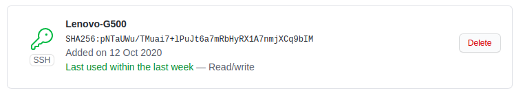
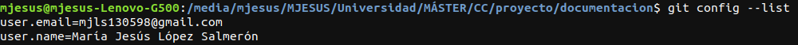
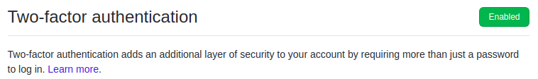

# Configuración del entorno

## Creación de par de claves y subida de clave pública a GitHub

Una vez instalado git en el ordenador, se crean las claves necesarias para la comunicación entre los repositorios locales y los remotos.

Para crear dichas claves primero se debe abrir el terminal y, a continuación, escribir lo que se muestre a continuación para generar las claves públicas y privadas:

`ssh-keygen -t rsa -b 4096 -C "mjls130598@gmail.com"`

Siendo dicho correo la dirección de correo en GitHub.

Dentro de la ejecución del comando anterior, se presiona Intro cuando se indique "Ingresar un archivo donde guardar la clave" y por último se escribe la contraseña.

Una vez generadas las claves, se copia las claves utilizando el plugin "xclip" como se muestra a continuación:

`xclip -sel clip < ~/.ssh/id_rsa.pub`

Siendo " ~/.ssh/id_rsa.pub" el archivo que contiene la clave pública.

Cuando se haya copiado la clave pública, se dirige a la configuración de GitHub, al apartado "Llaves SSH y GPG" y se crea una llave pegando la clave pública anterior.

El resultado de los pasos anteriores se muestra en la siguiente imagen:

## Configuración correcta del nombre y correo electrónico cada vez que aparezcan los commits

Para configurar el nombre y el correo electrónico se escriben los siguientes comandos, el primero es para configurar el nombre y el último el correo:

`git config --global user.name "María Jesús López Salmerón"`

`git config --global user.email "mjls130598@gmail.com"`

Para ver que se ha configurado correctamente escribimos `git config --list` y debería devolver lo que se muestra a continuación:

## Edición del perfil de GitHub

En cuanto a la edición del perfil de la cuenta en GitHub, se debe redirigir al perfil de la cuenta y dar al botón "Editar perfil". En él se escribe el nombre del usuario, su ciudad y la universidad y se añade una foto de perfil. 

Mi perfil se puede observar en la siguiente imagen:

## Activar el segundo factor de autenticación

La activación del segundo factor de autenticación se realiza en el apartado "Seguridad de la cuenta" dentro de la configuración de GitHub. En esa página se redirige a la sección "Autenticación de dos factores" y le damos a activar. 

Una vez activado se elige una de las dos opciones que ofrece GitHub: si queremos realizarlo a través de la aplicación GitHub para móviles o a través de un SMS al móvil. En mi caso, se eligió la opción del SMS. 

La comprobación de que se ha realizado los pasos anteriormente comentados se muestra a continuación:

