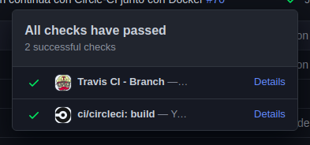

# Actividades relacionadas con Milestone 4

Todas las tareas realizadas para este milestone se encuentran en [este enlace](https://github.com/mjls130598/SharingNotes/milestone/11) que dirige a los distintos issues creados.

## Travis CI

Para darse en alta en *Travis* con la cuenta de GitHub y activar este repositorio dentro de él, se ha realizado de la misma manera que en uno de los [ejercicios de integración continua](https://github.com/mjls130598/CC-ejercicios/blob/master/ej_tema2.md#ejercicio-5). La única diferencia es que se realiza con travis.com en vez de travis.org.

A continuación, se crea el fichero *.travis.yml* para que comience a ejecutar los test, que tiene la siguiente estructura:

```
# Se dice que no trabaje con el superusuario
sudo:false

# Se indica en lenguaje que se va a utilizar
language: scala

# Se indican las versiones que se quieren comprobar
scala:
  - 2.12.12
  - 2.11.12

# Se dicen la versión de Java que debe utilizar
jdk:
  - openjdk11

# Antes de ejecutar los test, que compile el proyecto
before-script: sbt ++$TRAVIS_SCALA_VERSION compile test:compile

# Ejecute los tests
script:
```

Se utiliza las versiones 2.12.12 y 2.11.12 de Scala porque son dos versiones con las que la biblioteca *EmailAddress* (la que se encarga de comprobar si un string dado tiene la estructura de un correo electrónico) puede trabajar. Nos centramos en la biblioteca anterior puesto que es la única que aún no es compatible con la última versión de *Scala*.

En cuanto al apartado *script*, no se le dice nada porque por defecto hace sbt ++$TRAVIS_SCALA_VERSION test.

La información sacada para ejecutar *Travis* con el gestor de tareas *SBT* proviene de la página web oficial de [*Travis*](https://docs.travis-ci.com/user/languages/scala/) que indica como debería hacerse y algunos ejemplos al final de la página.

Cuando se intenta ejecutar *Travis* con esta versión de [*build.sbt*](https://github.com/mjls130598/SharingNotes/blob/d6dd8bce1a04d463919a13c83b5ae0b65680bc94/build.sbt), se produce el siguiente error:
`Switch failed: no subprojects list "2.11.12" (or compatible version) in crossScalaVersions setting.`

Por lo que se añade *crossScalaVersions* para que pueda ejecutar en ambas versiones dentro de *build.sbt* de la siguiente manera: `crossScalaVersions := List("2.12.12", "2.11.12")`. Esto se ha sacado de la página oficial de [*SBT*](https://www.scala-sbt.org/1.x/docs/Cross-Build.html).

## Otros sistemas de integración continua

A continuación, se va a realizar integración continua con el contenedor *Docker* creado en el milestone anterior. Para ello, primero elegimos el sistema con el que se va a realizas.

Algunos de los sistemas de integración continua que hay, además de *Travis*, son los siguientes:

* *Jenkins*: Conocido por ser el más seguro y elaborado, aunque no trabaja con los workflow de Docker. Puede trabajar con cualquier tipo de repositorios, e incluso, sin asociación a un repositorio.

* *Circle-CI*: abierto y ligero. Como Travis, funciona atado a un repositorio de git (ya sea GitHub, Gitlab u otro gestor de versiones) y la herramienta de configuración se encuentra en formato yaml.

* *Shippable*: es una plataforma de automaticación DevOps que incluye CI. Ayuda a automatizar implementaciones en entornos sucesivos, a administrar lanzamientos con versiones semánticas y puertas de aprobación, a automatizar el aprovisionamiento de infraestructura, a ver y administrar pipelines en toda su organización y a realizar una serie de otras actividades de DevOps.

De las tres comentadas, se decidió realizar con *Circle-CI*.

Primero se autoriza a *Circle-CI* acceder a nuestra cuenta de GitHub como se realiza en la siguiente imagen:


Una vez autorizado, se crea una carpeta oculta llamada *.circleci* y dentro de ella debe estar el archivo *config.yml* que contiene la configuración para este sistema de integración continua utilizando *Docker*, en este caso:

```
version: 2
jobs:
 build:
   machine: true
   steps:
     - checkout

     # Crea el contenedor      
     - run: docker build -t mjls130598/sharingnotes .

     # Ejecuta el contenedor
     - run: docker run --rm mjls130598/sharingnotes
```

La información sacada para realizar esta configuración es de una de las páginas oficiales de [*Circle-CI*](https://circleci.com/docs/2.0/building-docker-images/).

Por defecto, *Circle-CI* se ejecuta cuando haya modificaciones en el repositorio de GitHub.

Se puede ver que se realiza correctamente cuando hay un tic verde al lado del último commit y, si se pincha sobre él, debería salir una pestaña como la de la siguiente imagen:



## Avance del proyecto

* Antes de seguir con las actividades relacionadas con el milestone 4, se arreglaron algunos aspectos de los dos últimos milestones anteriores. Los issues correspondientes a estos arreglos se encuentran en el milestone ["Arreglos del milestone 2 y 3"](https://github.com/mjls130598/SharingNotes/milestone/12?closed=1) que se realizaron:

  * Se corrigió la estructura del proyecto, poniendo el directorio que contiene el código del proyecto en la raíz del proyecto y su estructura interior dejándola de la siguiente manera:
  ```
  src/
  |-- main/
    |-- scala/
      |-- SharingNotes/
  |-- test/
    |-- scala/
  ```

  * Se mejoró la seguridad con respecto al usuario cambiando la clase controladora por una clase controladora "estática" para que las clases Administrador y Usuario pudieran llamarla y ver los cambios realizados sobre esa clase. En Scala no existe la palabra *static*, por lo tanto, la manera de realizar una clase "estática" es creando una clase que contenga los datos y, después, crear un *object* con el mismo nombre que la clase anterior que se encarga de modificar los datos de esa clase.

  * Antes de guardar un apunte, se comprobó que el archivo dado es un PDF. Para comprobarlo hizo falta instalar como dependencia *Tika* puesto que tiene un método que puede detectar el formato de un fichero. Para que cualquiera pueda pasar los tests correspondientes a esta parte, se creó el directorio *documentos_prueba" con un conjunto de ficheros de distintos tipos.

  * Una vez comprobado que ese archivo es un PDF, se guardan dentro del sistema. Para guardarlo se añadió como dependencia del proyecto varias dependencias de *Hadoop* que realiza una copia exacta del fichero dado.

  * Se cambió la manera de crear nuevos identificadores. Se realizó de la misma manera que una página encontrada dentro de GitHub de [sarveshseri](https://gist.github.com/sarveshseri/f188a1a52ff966c63ea4). Se cambió los métodos encargados de crear elementos del sistema indicando que, una vez creado, se debe devolver el identificador creado para ese elemento.

  * Por último, se cambió la imagen base de Docker a *Alpine* puesto que, en comparación con otras probadas como *Ubuntu* y *Debian-Slim*, es la que menos tamaño ocupa para este proyecto.

* Después de realizar el ejercicio en la clase de prácticas del 16/12, se corrigieron cada una de las historias de usuario cuyos issues tienen la etiqueta [user-stories](https://github.com/mjls130598/SharingNotes/labels/user-stories). Además, se creó un [glosario](https://github.com/mjls130598/SharingNotes/issues/62) para que se entendieran las distintas terminologías. A continuación se arregló el código para que cumplieran las condiciones de satisfacción de cada una de las historias:

  * Comprobar que el correo electrónico dado no existe en el sistema y que está escrito correctamente. Para esta última comprobación se utilizó el código de la página de [*Scaladex*](https://index.scala-lang.org/hmrc/emailaddress/emailaddress/2.1.0?target=_2.12) que tiene una clase que comprueba la forma del correo dado. Como no se encontró ninguna otra manera que utilizara la versión de *Scala 2.13*, se decidió cambiar la versión de *Scala* a la 2.12. Corresponde al issue número [58](https://github.com/mjls130598/SharingNotes/issues/58).

  * Cuando se borra un elemento, devolver true si se ha realizado correctamente. Estos cambios se ven en los issues [63](https://github.com/mjls130598/SharingNotes/issues/63), [64](https://github.com/mjls130598/SharingNotes/issues/64) y [65](https://github.com/mjls130598/SharingNotes/issues/65).

  * En aquellos casos que se produce un error, devolver una excepción al usuario, por ejemplo cuando se quiere insertar el apunte de una asignatura desconocida. Los issues correspondientes son [60](https://github.com/mjls130598/SharingNotes/issues/60) y [61](https://github.com/mjls130598/SharingNotes/issues/61).

* Se ha avanzado en algunos aspectos del proyecto que aún no se ha podido realizar:

  * Cuando se borre una asignatura, se borre su carpeta correspondiente dentro de la memoria del sistema. Los cambios realizados se ven el [issue 56](https://github.com/mjls130598/SharingNotes/issues/56).

  * Cuando se borre un apunte, se borre el archivo de ese apunte. Los commits relacionados con lo anterior se encuentran en el [issue 55](https://github.com/mjls130598/SharingNotes/issues/55).

  * Antes de comenzar con las búsquedas, se han tenido que realizar las siguientes tareas:

    * Abrir y leer PDFs. Utilizando la biblioteca de *Tika*, se obtuvo el texto que contiene un PDF. Se puede ver los cambios realizados en este [enlace](https://github.com/mjls130598/SharingNotes/issues/52).

    * Indexar los PDFs guardados. Para indexar los documentos se ha tenido que instalar como una dependencia la biblioteca *Lucene 8.7.0*. Antes de indexar, se ha configurado el índice que se va a crear indicando los analizadores que se va a usar, la medida de similitud, qué campos se van a indexar y qué campos van a ser las facetas (filtros). Se encuentra en el issue [66](https://github.com/mjls130598/SharingNotes/issues/66).
